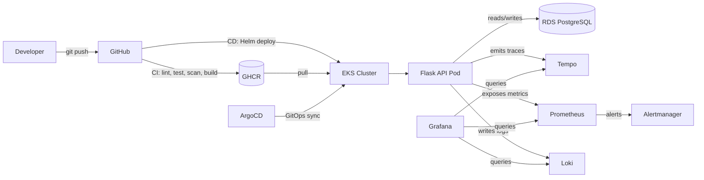

# Architecture — Volume 2

## Boundaries

| Layer | Tool | Scope |
|---|---|---|
| Infrastructure | Terraform | VPC, EKS, RDS, ECR, IAM |
| App platform | Kubernetes + Helm | Application workloads, config |
| GitOps | ArgoCD | Declarative sync from Git to cluster |
| CI | GitHub Actions | Lint, test, scan, build |
| CD | GitHub Actions + Helm | Deploy to staging/production |
| Metrics | Prometheus + custom metrics | App health, latency, error rates |
| Logs | Loki + Promtail | Centralized log aggregation |
| Traces | OpenTelemetry + Tempo | Distributed tracing |
| Alerting | Alertmanager | Route alerts to Slack |
| Security | Trivy, Network Policies | Vulnerability scanning, pod isolation |

## Key Differences from Volume 1

The static Nginx app is replaced with a Flask API that connects to PostgreSQL. Kubernetes manifests are packaged into a Helm chart with environment overlays. ArgoCD manages the sync from Git to cluster. The monitoring stack adds Loki for logs and Tempo for traces alongside Prometheus/Grafana. CI includes integration tests and Trivy vulnerability scanning. Database migrations run as part of the deployment lifecycle.
